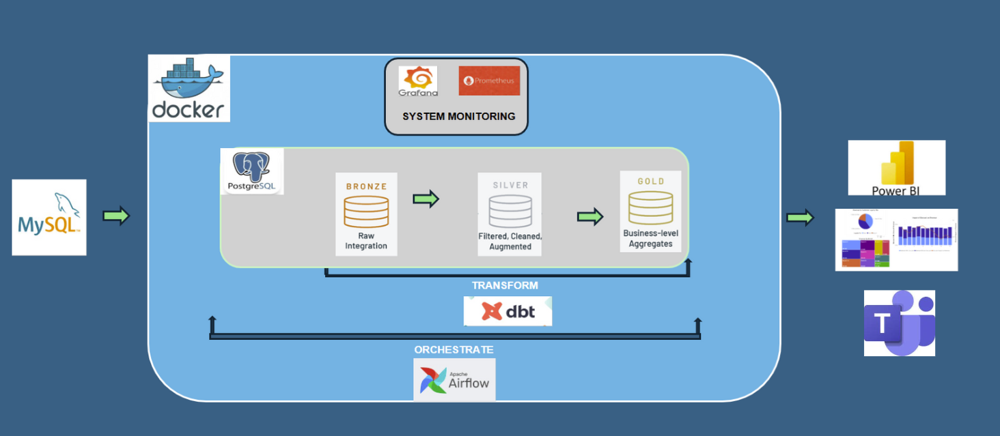
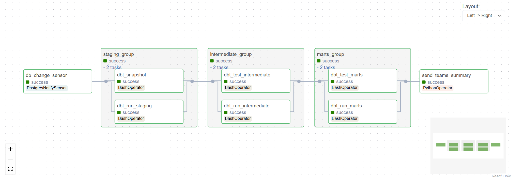

# FINAL_FPT_TRAINING_PROJECT: Retail Data Pipeline

This project demonstrates a modern retail analytics pipeline using Python, Airflow, dbt, and PostgreSQL/MySQL. It covers synthetic data generation, ETL orchestration, transformation, and data quality assessment.

---

## 1. Pipeline Architecture

# Data Pipeline Architecture

This architecture demonstrates an **end-to-end retail analytics pipeline** that integrates, transforms, monitors, and visualizes data.

---

## 🔹 Data Sources
- **MySQL**: Acts as the source system containing raw transactional data.

---

## 🔹 Data Lakehouse (on PostgreSQL, Dockerized)
The pipeline is containerized using **Docker**, and data is ingested into a **PostgreSQL** database where it is processed through different layers:

1. **Bronze Layer (Raw Integration)**  
   - Stores raw ingested data from MySQL.  
   - Minimal processing is applied, preserving data fidelity.  

2. **Silver Layer (Filtered, Cleaned, Augmented)**  
   - Data quality checks, cleaning, and enrichment are performed.  
   - Invalid records are separated, and valid records are standardized.  

3. **Gold Layer (Business-level Aggregates)**  
   - Business-friendly tables and aggregations.  
   - Optimized for reporting and analytics.  

---

#### 🔹 Transformation Layer
- **dbt (Data Build Tool)** is used to transform the data across **Bronze → Silver → Gold**.  
- Implements:
  - Data modeling  
  - SCD (Slowly Changing Dimensions) handling  
  - Data quality tests  
  - Documentation  

---

#### 🔹 Orchestration Layer
- **Apache Airflow** manages the scheduling and orchestration of the pipeline.  
- Handles:
  - Extracting data from MySQL  
  - Loading into PostgreSQL (Bronze)  
  - Triggering dbt transformations (Silver & Gold)  

---

#### 🔹 Monitoring & Alerting
- **Prometheus + Grafana** provide monitoring of system metrics, DAG runs, and pipeline health.  
- Real-time dashboards and alerts help ensure reliability.  

---

#### 🔹 Analytics & Visualization
- **Power BI** consumes the **Gold layer** to deliver interactive dashboards and reports for business users.  

---

####  Workflow Summary
1. **Extract**: MySQL → PostgreSQL (Bronze)  
2. **Transform**: dbt applies transformations (Silver & Gold)  
3. **Orchestrate**: Airflow manages workflow execution  
4. **Monitor**: Prometheus & Grafana track performance and alerts  
5. **Visualize**: Power BI delivers insights to end users  


---

## 2. ETL Orchestration


**File:** `dags/data_load_mysql_2_postgres.py`

- **Purpose:** Automate the transfer of multiple retail tables from MySQL to PostgreSQL using Airflow.
- **Key Features:**
  - Uses Airflow’s PythonOperator and TaskGroup for scalable, parallelized table transfers.
  - Adds `load_timestamp` for each row to support incremental dbt models.
  - Modular design: easily add/remove tables from the transfer list.
  - Prints transfer summaries for monitoring.

---

## 3. Data Transformation (dbt)

**File:** `dbt_project/retails_project/models/staging/stg_sales_transactions.sql`

- **Purpose:** Transform raw data into clean, queryable staging tables using dbt.
- **Key Features:**
  - Implements incremental loading using dbt’s `merge` strategy.
  - Filters new data based on `load_timestamp`.
  - Ensures unique keys and efficient updates.

---

## 4. Data Quality Assessment

**File:** `data_quality_assessment.ipynb`

- **Purpose:** Validate data integrity and completeness in the delivery (marts) layer.
- **Key Features:**
  - Checks for missing values and columns with nulls.
  - Detects duplicate keys in candidate ID columns.
  - Validates referential integrity between fact and dimension tables.
  - Summarizes results for each table, highlighting issues.

---

## 5. Pipeline Monitoring & Notification

**File:** `dags/ms_alert.py`

- **Purpose:** Orchestrate dbt runs/tests and send results to Microsoft Teams.
- **Key Features:**
  - Listens for database changes using custom PostgreSQL sensors.
  - Runs dbt models and tests in sequence.
  - Parses logs and sends summarized results to MS Teams via webhook.
  - Supports real-time alerting for failures or data issues.

---

---

## 6. Synthetic Data Generation & Ingestion

**File:** `ingest_data.ipynb`

- **Purpose:** Rapidly generate realistic retail transaction and sales item data for testing and development.
- **Key Features:**
  - Uses `numpy` and `pandas` to create synthetic datasets for both transactions and items.
  - Ensures referential integrity by matching `transaction_id` in items to those in transactions.
  - Adds a `load_timestamp` column for incremental ETL and auditing.
  - Loads data directly into PostgreSQL using SQLAlchemy, targeting the `pos_raw_retails_data` schema.
  - Supports easy adjustment of row counts for scalability.
  - Displays samples for quick validation.

**Example:**
```python
# Transaction data
df = pd.DataFrame({
    "transaction_id": range(1, n_rows + 1),
    ...
    "load_timestamp": [datetime.now()] * n_rows
})

# Sales items data
df_items = pd.DataFrame({
    "item_id": range(104001, 104001 + n_items),
    "transaction_id": np.random.randint(1, 11, size=n_items),
    ...
    "load_timestamp": [datetime.now()] * n_items
})
```

---


## 7. Deployment & Monitoring

- **Docker Compose:** Sets up Airflow, PostgreSQL, MySQL, and Redis for local development.
- **Prometheus & StatsD:** Integrated for pipeline and system metrics.

---

## Highlights

- **End-to-End Automation:** From data generation to reporting and alerting.
- **Incremental & Auditable:** All data loads are timestamped for traceability.
- **Quality-First:** Automated checks for missing, duplicate, and orphaned data.
- **Scalable & Modular:** Easily extend to new tables or data sources.
- **Real-Time Notification:** Immediate feedback on pipeline health via Teams.

---

This project is a robust template for building production-grade retail analytics pipelines with modern data engineering tools.
